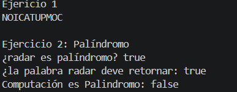
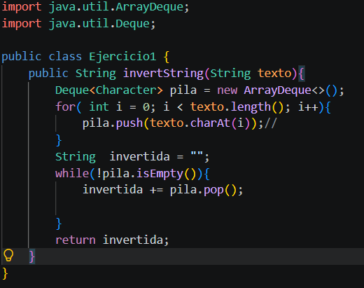
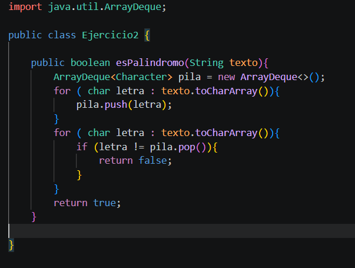

# Práctica: Estructuras Dinámicas Lineales

## Datos del Estudiante
- **Nombre:** Galo Patricio Prieto Tapia
- **Curso:** Computación
- **Fecha:** 10 de junio del 2026

---

## 1. Implementación de estructuras dinámicas lineales

**Fecha:** [10 de junio del 2026]

**Descripción:** 

En esta práctica se implemento ejemplos de Linked,Queue y ArrayDeque para comprender el funcionamiento de listas , colas y pilas en java mediante operaciones de inserccion eliminacion y recorrido.

### Captura de salida en consola




### Captura del código de implementación del ejercicio 1





o bloque de código .


## 2. Ejercicio Palíndromo

**Fecha:** [10 de junio del 2026]

**Descripción:**

Se implementó el método esPalindromo() usando una pila para comparar una palabra con su versión invertida y determinar con un tipo de pregunta si es palíndromo. 

### Método implementado

````java
public boolean esPalindromo(String texto){
        ArrayDeque<Character> pila = new ArrayDeque<>();
        for ( char letra : texto.toCharArray()){
            pila.push(letra);
        }
        for ( char letra : texto.toCharArray()){
            if (letra != pila.pop()){
                return false;
            }
        }
        return true;
    }